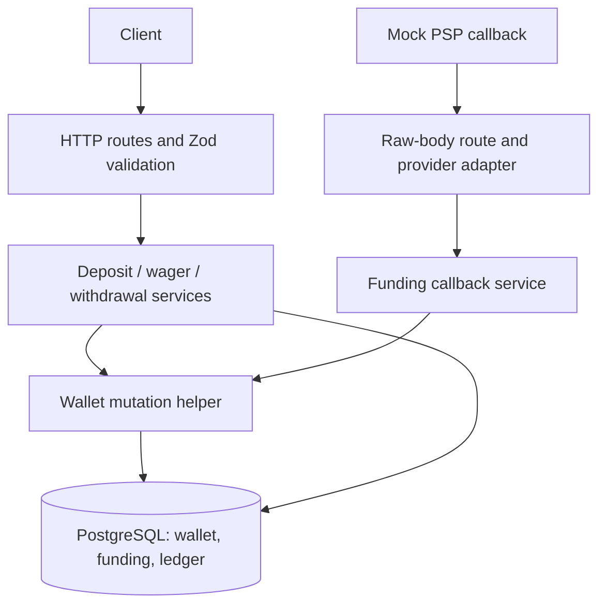
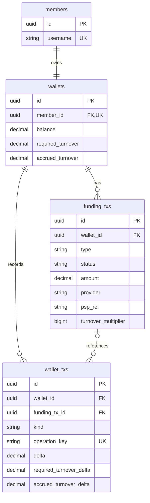
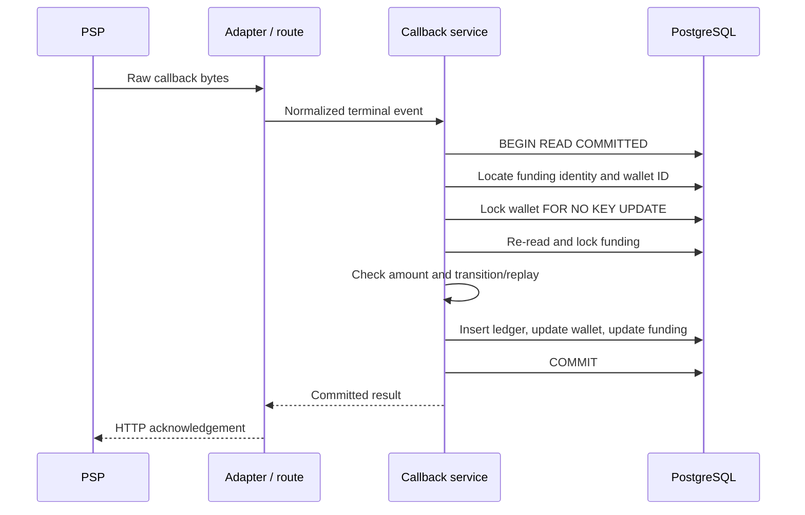
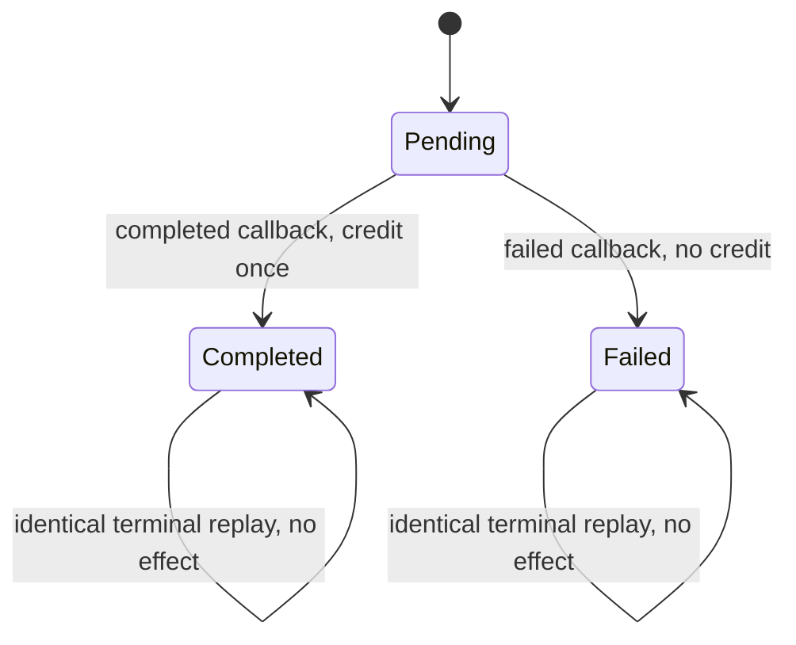

# Architecture and Money Invariants

## Application boundaries

The service remains a single modular Express application. The important consistency boundary is a PostgreSQL transaction, so splitting the wallet into network services would add failure modes without helping the assignment.



Routes validate/serialize HTTP and delegate business decisions. Services own transaction boundaries. [`walletMutation.ts`](../starter/src/services/walletMutation.ts) supplies transaction retry/deadline handling, wallet locking and ledger/projection updates. Models describe persistence; migrations create schema and enforce constraints. PSP adapters normalize external messages and do not update wallets.

Creating a deposit only inserts one Pending funding row; it does not need a wallet money lock. Member creation writes the member and its zero-balance wallet in one transaction. Money-changing operations pass the same transaction explicitly to every participating write.

## Data model



The diagram shows references; business rules further restrict valid funding effects. Wagers have no funding reference. A completed deposit has one credit entry; a Pending/Failed deposit has none. A withdrawal has one debit entry immediately, including while its funding status is Pending.

All money/counter columns use `DECIMAL(36,18)`. API amounts and results are strings; arithmetic uses BigNumber through [`money.ts`](../starter/src/lib/money.ts). There is no float conversion or implicit rounding in the application money path. The turnover multiplier is nonnegative safe-integer metadata, converted for decimal multiplication.

## Invariants

For every wallet, starting at zero:

```text
balance          = sum(wallet_txs.delta)
requiredTurnover = sum(wallet_txs.requiredTurnoverDelta)
accruedTurnover  = sum(wallet_txs.accruedTurnoverDelta)
balance >= 0
```

Each successful money mutation writes its ledger entry and updates wallet counters in the same transaction. Funding state changes that complete a deposit participate in that transaction too. Reconciliation reads a read-only REPEATABLE READ snapshot so comparisons do not straddle different commits.

Database constraints reinforce application rules: unique provider/reference identity, unique operation keys and funding/kind effects, a composite funding/wallet foreign key, nonnegative finite wallet counters, and valid ledger-effect shapes. Runtime privileges and an UPDATE/DELETE trigger protect append-only history. Cross-row ledger/projection equality still depends on service transactions and reconciliation; a CHECK constraint alone does not establish it.

## Callback transaction and lock ordering



The writes shown are the Pending → Completed path. Exact terminal replay performs no new money writes. A failed callback changes funding state without crediting. Mismatched amounts, unknown references and conflicting terminal states are rejected.

All wallet money writers acquire the wallet lock before making balance/turnover decisions. Callbacks then lock funding in the common **wallet → funding** order. A second callback waits and re-reads the committed state, so it recognizes replay. Two wagers of 80 against balance 100 serialize: the second sees 20 and is rejected.

`FOR NO KEY UPDATE` serializes wallet writers while permitting the foreign-key key-share check needed to insert Pending funding. Wallet identity is not modified by these money operations. A hot wallet remains a serialized resource; more connections do not remove this constraint.

## Funding states and turnover



This diagram is for deposits. Opposite terminal transitions return 409. Amount mismatch returns 422 even after a funding record is terminal. Withdrawals remain Pending in this implementation; approval, external payout and refund/reversal workflows are outside scope.

Each completed deposit adds `amount × multiplier` to required turnover. Each successful wager adds its amount to accrued turnover and debits balance. Withdrawal requires accrued ≥ required and enough balance. Accrued turnover is cumulative over the wallet lifetime, is not consumed/reset by withdrawal, and can satisfy later deposit requirements.

## Failure boundaries

Internal retries restart the whole transaction only for PostgreSQL `40001` and `40P01`, with at most two retries after the first attempt and a shared deadline. There are no outbound network effects inside these transactions. A failure after a ledger write therefore rolls it back along with the wallet/funding writes.

Connection loss during COMMIT can leave the caller uncertain. A deposit callback can be replayed using durable funding identity. Wagers and withdrawals currently lack HTTP idempotency keys, so blind client retry after an ambiguous result is not guaranteed safe. This is distinct from internal retry after a known transaction abort.
